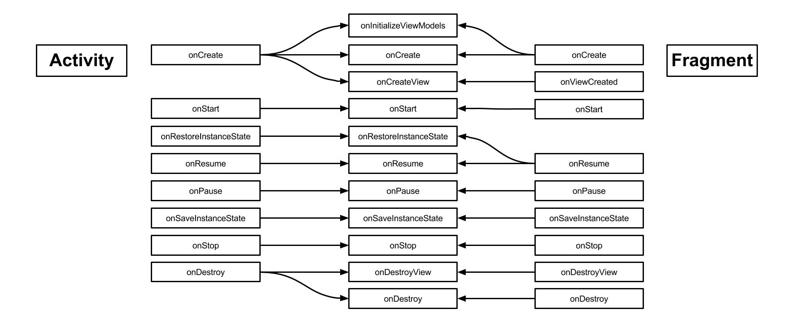
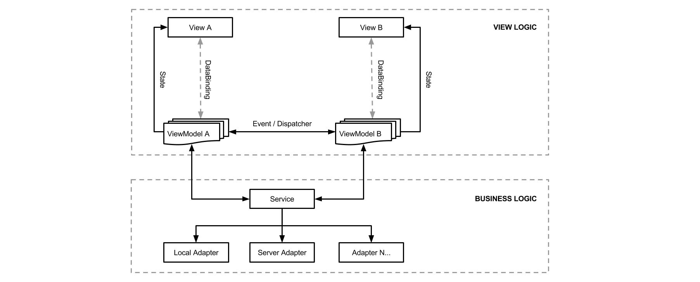

[  ](https://bintray.com/henrytao-me/maven/mvvm-life-cycle/_latestVersion)

MVVM Life Cycle
================

Unify activity and fragment life cycle for MVVM architecture


## Installation

```
compile "me.henrytao:mvvm-life-cycle:<latest-version>"
```

`mvvm-life-cycle` is deployed to `jCenter`. Make sure you have `jcenter()` in your project gradle.


## Demo

[](https://play.google.com/store/apps/details?id=me.henrytao.mvvmlifecycle)

Please note that the app on the Play store is not always the latest version.


## Concepts






## Contributing

Any contributions are welcome!
Please check the [CONTRIBUTING](CONTRIBUTING.md) guideline before submitting a new issue. Wanna send PR? [Click HERE](https://github.com/henrytao-me/mvvm-life-cycle/pulls)


## Special thanks to

- [longbkiter07](https://github.com/longbkiter07) for RxJava SubscriptionManager


## License

    Copyright 2016 "Henry Tao <hi@henrytao.me>"

    Licensed under the Apache License, Version 2.0 (the "License");
    you may not use this file except in compliance with the License.
    You may obtain a copy of the License at

        http://www.apache.org/licenses/LICENSE-2.0

    Unless required by applicable law or agreed to in writing, software
    distributed under the License is distributed on an "AS IS" BASIS,
    WITHOUT WARRANTIES OR CONDITIONS OF ANY KIND, either express or implied.
    See the License for the specific language governing permissions and
    limitations under the License.


